  

Hello, I'm Ali, a full-stack software engineer with an Industrial Engineering background.

I don't want to repeat my resume here. You can already find my work and experience on LinkedIn and my portfolio: [alikayar.com](https://alikayar.com)

Instead, I'd rather talk a bit about how I ended up here and what I'm interested in.

## Why programming after Industrial Engineering?

At the end of high school, I knew I wanted to solve problems and become an engineer, but I couldn't decide on a specific field. Industrial Engineering seemed broad enough to let me explore.

During university, I spent time working in factories and noticed how much repetitive work could be automated even with simple software.

That curiosity led me to VBA and automating Office workflows. Afterwards, I moved to Python for web scraping and reverse engineering APIs. Since graduating, I've been working mainly with Node.js as a backend-first full-stack software engineer.

I still think my Industrial Engineering background affects how I approach software. I'm usually interested in simplifying processes, standardizing them, and automating repetitive work.

## What am I working toward?

I'm not anti-AI. I use it regularly and have spent time learning about skills, plugins, MCP servers, RAG systems, and how to integrate them into my workflows.

But that doesn't mean giving up control. Instead, I've been reviewing my code more carefully and spending more time understanding fundamentals, architecture and systems.

There is still a lot I want to learn: system architecture, microservices, distributed and scalable systems, building systems that can handle very high request volumes, and efficient backend services with languages like Go.

I'm not particularly focused on reaching a specific title. I mostly want to keep becoming a better engineer and solve real problems.

Right now, I'm spending more time exploring open-source software, infrastructure and how computers work under the hood.

---

[alikayar.com](https://alikayar.com)
